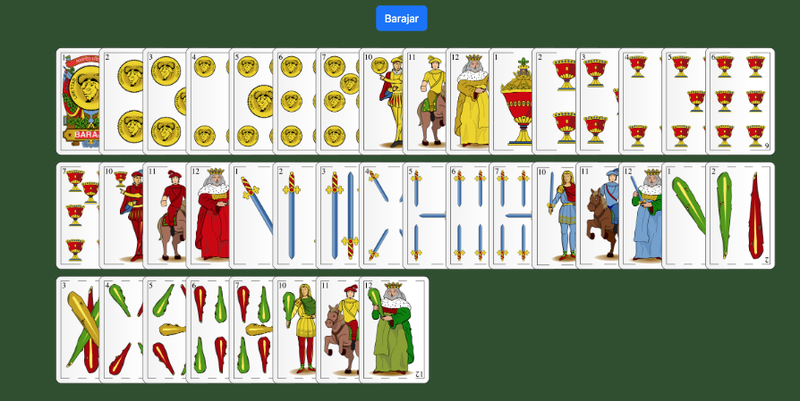
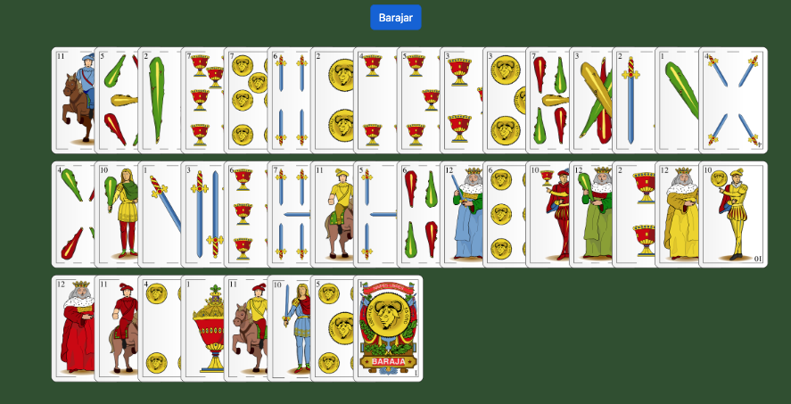
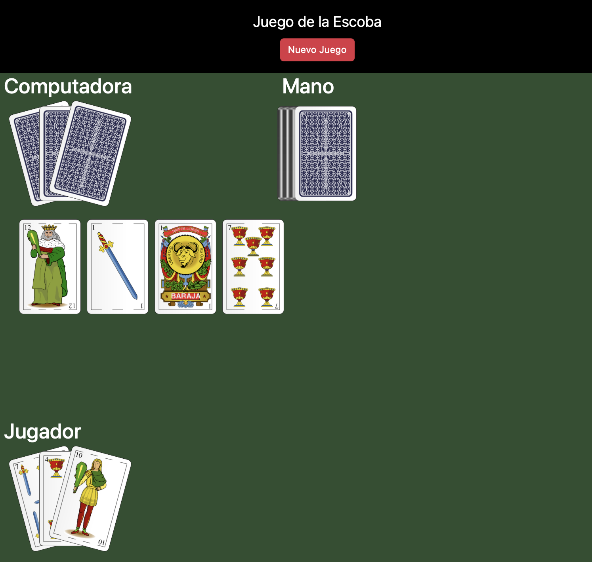
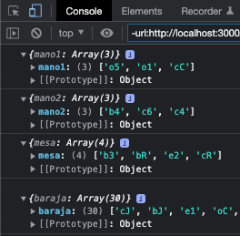
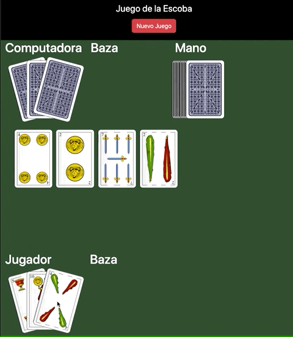
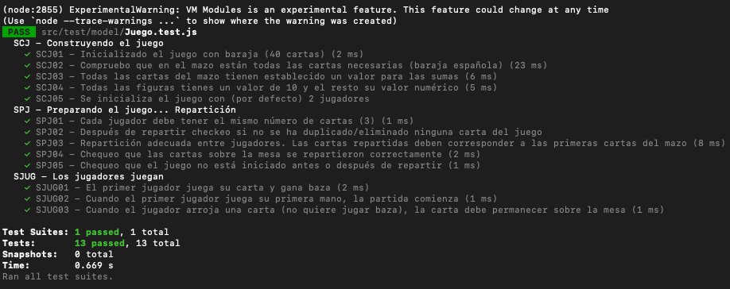
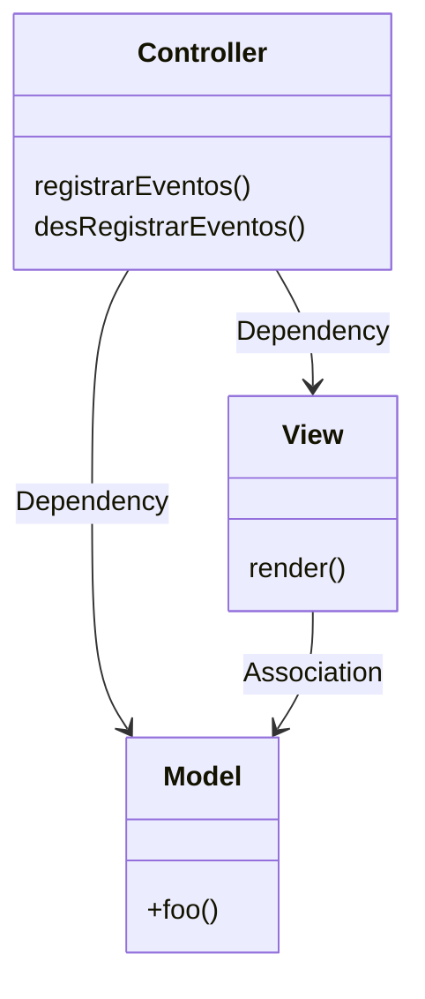

# Hitos

En esta sección se irán detallando las tareas que son necesarias realizar. Están planteadas para realizar los diferentes hitos en orden, y **elevando versión a cada paso**.

Recuerda hacer push de tu rama *release branch* (rb-usuario) y también de las tags que se corresponden a cada hito. **Recuerda ponerle el prefijo de tu usuario a la tag**: `usuario-vX.Y.Z`

- [1. Hito: Construye una baraja y represéntala en un tapete - `release/nombreApellido/v0.1.0`](#1-hito-construye-una-baraja-y-represéntala-en-un-tapete---releasenombreapellidov010)
- [2. Hito: Reparte la baraja conforme a las normas del juego de la escoba - `release/nombreApellido/v0.2.0`](#2-hito-reparte-la-baraja-conforme-a-las-normas-del-juego-de-la-escoba---releasenombreapellidov020)
- [3. Hito: Juega una mano del jugador ganando bazas - `release/nombreApellido/v0.3.0`](#3-hito-juega-una-mano-del-jugador-ganando-bazas---releasenombreapellidov030)
- [4. Hito 4: Modelado y diseño del juego de la escoba con orientación a objetos `release/nombreApellido/v0.4.0`](#4-hito-4-modelado-y-diseño-del-juego-de-la-escoba-con-orientación-a-objetos-releasenombreapellidov040)
- [5. Hito: Utilizando un bundler para el desarrollo del front. Vite como frontend tool frente a alternativas como Webpack y Turbopack `release/nombreApellido/v0.5.0`](#5-hito-utilizando-un-bundler-para-el-desarrollo-del-front-vite-como-frontend-tool-frente-a-alternativas-como-webpack-y-turbopack-releasenombreapellidov050)
- [6. Hito: De acuerdo al patrón arquitectónico MVC (Model-View-Controller), y teniendo desarrollada parte de la lógica del juego (en el Model), se implementarán los componestes *Views* y *Controllers* `release/nombreApellido/v0.6.0`](#6-hito-de-acuerdo-al-patrón-arquitectónico-mvc-model-view-controller-y-teniendo-desarrollada-parte-de-la-lógica-del-juego-en-el-model-se-implementarán-los-componestes-views-y-controllers-releasenombreapellidov060)

## 1. Hito: Construye una baraja y represéntala en un tapete - `release/nombreApellido/v0.1.0`

1. Revisa el código de [`src/assets/js/01-desplegar-baraja.js`](../src/assets/js/01-desplegar-baraja.js), sólo tendrás que modificar este fichero (no podrás escribir en otros)

1. Lee los comentarios y escribe tu código donde figuran las etiquetas `TODO` (elimínalas conforme vayas resolviendo)

1. El resultado deberá corresponderse con la siguiente imagen cuando abras con tu navegador el fichero [`src/01-baraja-desplegada.html`](../src/02-repartir-escoba.html)

    

1. Nota que no deben aparecer los ochos y los nueves en la baraja sobre el tapete.

1. Cuando se presione el botón `Barajar`, las cartas deben aparecer barajadas (sin repeticiones y exactamente el mismo número de cartas de la baraja).

    

1. 📚 *Pista que te será muy útil para resolverlo*: Revisa la  librería [UNDERSCORE.JS](https://underscorejs.org/#), muy popular en javascript. Te facilitará un montón de *helpers* y uno de ellos, te será especialmente útil para resolver el problema. Revisa en su documentación el apartado *Collections*.

## 2. Hito: Reparte la baraja conforme a las normas del juego de la escoba - `release/nombreApellido/v0.2.0`

1. Se trata de repartir las cartas sobre el tapete de acuerdo a las normas del [*juego de la escoba*](https://es.wikipedia.org/wiki/Escoba_del_15).

2. Revisa el código de [`src/assets/js/02-repartir-escoba.js`](../src/assets/js/02-repartir-escoba.js), sólo tendrás que modificar este fichero (no podrás escribir en otros)

3. Lee los comentarios y escribe tu código donde figuran las etiquetas `TODO` (elimínalas conforme vayas resolviendo)

4. El resultado deberá corresponderse con la siguiente imagen cuando abras con tu navegador el fichero [`src/02-repartir-escoba.html`](../src/02-repartir-escoba.html)

    

5. Deberá poder advertirse por consola el valor de las manos de cada jugador y la mano pendiente de repartir (taco de cartas restantes), aunque desde su representación gráfica no se pueda advertir su valor.

    

6. Cuando se presione el botón `Nuevo Juego` se barajarán de nuevo las cartas y se procederá a repartirlas de nuevo (estado inicial de otro nuevo juego).

## 3. Hito: Juega una mano del jugador ganando bazas - `release/nombreApellido/v0.3.0`

1. Escribirás tu código en [`/src/assets/js/03-mano-escoba.js`](../src/assets/js/03-mano-escoba.js). **No podrás editar ni escribir nuevos ficheros**. Revisa los ficheros [`src/assets/css/03-style.css`](../src/assets/css/03-style.css) y [`src/03-mano-escoba.html`](../src/03-mano-escoba.html) para adecuar tu solución.

1. **Se trata de jugar la mano del jugador, arrojando cartas o ganando una baza al tapete** de acuerdo a las normas del [*juego de la escoba*](https://es.wikipedia.org/wiki/Escoba_del_15) y los matices e interactividad expresados en este hito.

1. El alcance de este hito es que **sólo juega el jugador** (no la computadora).

1. **Se parte del hito anterior** con las cartas repartidas para iniciar el juego y con la posibilidad de iniciar una nueva partida (barajado y nueva repartición) presionando el botón "*Nuego juego*". Puedes copiar y pegar tu código anterior en [`/src/assets/js/03-mano-escoba.js`](../src/assets/js/03-mano-escoba.js).

1. **El jugador seleccionará una carta de su mano clicando una vez sobre ella**. Para representar una carta seleccionada en la mano del jugador, emplearemos la clase `.carta-seleccionada` definida en [`src/assets/css/03-style.css`](../src/assets/css/03-style.css).

1. El jugador podrá des-seleccionar una carta previamente seleccionada haciendo clic sobre ella para corregir su intención de seleccionarla.

1. Una vez seleccionada una carta de la mano del jugador, **se irán seleccionando las cartas de la mesa para sumar 15 puntos** y poder llevarse la baza.

1. **No** se podrán seleccionar cartas de la mesa si no hay carta seleccionada en la mano del jugador (al menos por el momento).

1. **Si se excede la cantidad de 15 puntos** entre la carta seleccionada de la mano del jugador y las cartas seleccionadas de la mesa, entonces quiero que elimine toda la selección de las cartas de la mesa para volver a empezar a seleccionar las cartas y sumar 15 (puede ser que el jugador se equivoque en la suma).

    

1. Si se selecciona la carta de la mano del jugador y se consiguen seleccionar cartas en la mesa para que el conjunto de cartas seleccionadas sume exactamente 15 puntos, entonces quiero que todas esas cartas pasen a **formar parte de la baza del jugador** (pila de cartas situadas junto al jugador que representarán las bazas ganadas y que constituirán los puntos ganados por parte del jugador).

1. Una vez se haya ganado una baza, se puede repetir la operación hasta que no le queden más cartas al jugador (pero **no jugará la computadora en este hito**).

1. **Si NO hay posibilidad de sumar** exactamente 15 puntos, o sencillamente porque el jugador así lo prefiriese, se podría arrojar una carta a elección del jugador realizando un doble-clic sobre ella. Esta acción por parte del jugador significaría que se quiere arrojar la carta desistiendo (quizá equivocadamente) de la posibilidad de ganar alguna baza.

1. Puede ser que la carta que ha sido arrojada (con doble clic) sí tenga la posibilidad de sumar 15 pero la carta **quedará presa** (no se puede volver atrás). Quizá en un paso posterior quiera que el oponente pueda ganar esa baza perdida por el jugador (pero en este hito no).

1. Cuando el jugador termine sus cartas se termina la demostración (alcance de este hito) y **se podrá repetir la demostración** presionando el botón de  "*Nuego juego*".

    

## 4. Hito 4: Modelado y diseño del juego de la escoba con orientación a objetos `release/nombreApellido/v0.4.0`

1. El enfoque ha cambiado. Manejar la complejidad del juego con un paradigma estructurado resulta demasiado complicado. Por eso **giraremos en este hito a un enfoque de paradigma. Concretamente Orientado a Objetos**.

1. **Modelaremos las reglas del juego con objetos**. Nos olvidaremos por el momento de la interfaz gráfica, centrándonos en las reglas del juego. Aplicaremos una estrategia DDD (*Domain Driven Design*).

1. Debes adaptarte al diseño proporcionado. Hay en el código comentarios con la palabra clave `TODO` para que realices los cambios oportunos.

1. **Las especificaciones del hito están descritas en la documentación de los métodos**. Tienes más información sobre cómo documentar código javascript utilizando [JSDoc](https://jsdoc.app)

1. Aplicaremos una técnica de TDD (Test Driven Development). Se te proporcionan unos test en la rama `test`. **Debes orientar tu desarrollo para satisfacer estos test**. No debes cambiar los tests, sino adaptar tu código para que funcione y satisfaga los tests. **Después de esta primera aproximación, haremos refactorizaciones**. En esta primera aproximación debes asegurarte que satisfaces todos los tests. Visita [Jest](https://jestjs.io/es-ES/) si quieres conocer más detalles sobre la herramienta empleada para el testing. Aquí tienes un pantallazo de los tests satisfechos:

    

1. Ten muy en cuenta que **los tests irán evolucionando**. Hay **parte de la implementación que está deliberada y no deliberadamente SIN cobertura de pruebas** (no se prueba por el momento). Se te irán proporcionando más tests (en este mismo hito) y más especificaciones (en próximos hitos). Cuando haya una actualización en los tests verás que recibes una nueva tag de este tipo: `release/test/v1.x.x`.

1. La forma de **lanzar los tests** es con este comando en la raiz de tu repo es (entre otras variantes):

    ```bash
    npm run test
    ```

1. Los nuevos test vendrán provocados por una actualización del repositorio del profesor. No debes preocuparte de qué versión de los test emplear, porque será especificada en el fichero `package.json` cuando estime el profesor. **La forma de obtenerse una nueva versión de los tests** es con este comando en la raiz de tu repo (esto lanza el script `bin/update-test.sh` que deberías poder comprender ya):

    ```bash
    # Cuidado ya que se sobreescibirá cualquier cambio sobre los ficheros *.test.js
    npm run test:update
    ```

## 5. Hito: Utilizando un bundler para el desarrollo del front. Vite como frontend tool frente a alternativas como Webpack y Turbopack `release/nombreApellido/v0.5.0`

En este hito el objeto es incluir la herramienta [Vitejs](https://vitejs.dev) como soporte para el desarrollo de tu front.

Se aportarán contenidos adicionales para ayudarte en este incremento.

Los objetivos son:

- Debes lograr que no afecte al desarrollo de tu modelo logrado en el hito anterior. No debes modificar nada del mismo si ya satisfacía los tests.
- Los tests deben seguir funcionando como hasta ahora. Nada debe cambiar a este respecto en el repo.
- Deber proporcionar un ambiente de desarrollo a través de Vite ejecutando la siguiente instrucción: `npm run dev`.
- Debes arrastrar toda la lógica de tu hito 3 a este fichero `src/components/escoba.js`.
- Debes crear la *template* html que utilizamos en el hito 3 junto con los estilos previamente empleados.
- Debes hacer que se represente el juego gráficamente y sea funcional, tal y como se logró en el hito 3.
- No debes consumir la lógica del modelo. Esa es la refactorización que realizarás en el próximo hito.
- Debes valerte de las dependencias manejadas por `npm` para utilizar la library [*underscore*](https://www.npmjs.com/package/underscore).
- Trata también de utilizar `npm` para gestionar la dependencia con bootstrap.

## 6. Hito: De acuerdo al patrón arquitectónico MVC (Model-View-Controller), y teniendo desarrollada parte de la lógica del juego (en el Model), se implementarán los componestes *Views* y *Controllers* `release/nombreApellido/v0.6.0`

En este hito el objeto es implementar el juego con las mismas especificaciones del [Hito 3](#3-hito-juega-una-mano-del-jugador-ganando-bazas---releasenombreapellidov030), solo que empleando el patrón de diseño arquitectónico **MVC** [[español]](https://es.wikipedia.org/wiki/Modelo–vista–controlador) [[ingles]](https://en.wikipedia.org/wiki/Model–view–controller).

El componente Modelo (*Model*), se ha desarrollado ya en el [Hito 4](#4-hito-4-modelado-y-diseño-del-juego-de-la-escoba-con-orientación-a-objetos-releasenombreapellidov040), aplicando la técnica DDD (Domain Driven Design) y la técnica TDD (Test Driven Design). Ahora tendrás que implementar el Componente View (formado por un conjunto de vistas) y el Componente Controller (formado por un conjunto de controladores).

Debes tener en cuenta la descripción del patrón y las responsabilidades de cada uno de estos componentes y **las relaciones que mantienen entre sí**:



Ten además en cuenta lo siguiente:

1. No tendrás que implementar ahora tu modelo (implementado en el Hito 4). Quizá necesites, te convenga o dedidas refactorizar algo en el mismo, pero no debebiera ser necesario si has satisfecho todos los tests. Pero, **si refactorizas el modelo, es importante que todos los tests sigan dando el resultado esperado satisfaciéndolos todos**.

2. Es importante que respetes las relaciones del patrón. El Modelo nunca importará ninguna clase de Vista o Controlador. La Vista tampoco importará Controlador.

3. Te convendrá y mucho emplear el [Patrón de Diseño *Observer*](https://es.wikipedia.org/wiki/Observer_(patrón_de_diseño)) por si el Modelo tiene que comunicar algo al resto de componentes. Daremos más información al respecto y explicaremos este patrón.
